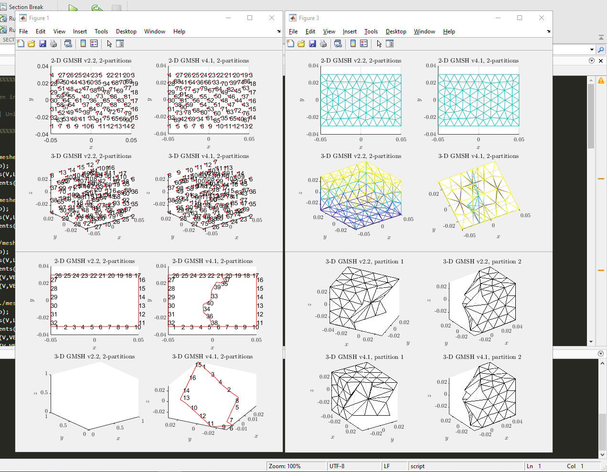

# GMSHparser

Parsers for Gmsh ASCII `.msh` files in format **v2.2** and **v4.1**, following the [Gmsh 4.15.2 reference](https://gmsh.info/doc/texinfo/gmsh.html).

The project provides:

- a **C++17 header library** under `cpp/include/gmshparser/`
- a **Python 3 package** (`gmshparser`) built with pybind11
- **Matlab reference implementations** under `Matlab/`

Supported element types (ASCII only; binary meshes are rejected):

| Geometry | Gmsh type IDs | Nodes (P1 / P2 / P3) |
|----------|---------------|----------------------|
| Point | 15 | 1 |
| Line | 1, 8, 26 | 2 / 3 / 4 |
| Triangle | 2, 9, 21 | 3 / 6 / 10 |
| Quadrilateral | 3, 10, 36 | 4 / 9 / 16 |
| Tetrahedron | 4, 11, 29 | 4 / 10 / 20 |
| Hexahedron | 5, 12, 92 | 8 / 27 / 64 |
| Prism | 6, 13, 90 | 6 / 18 / 40 |

High-order elements share the same geometry buckets as linear ones (`El.lin`, `El.tri`, …). Per-element Gmsh type IDs are stored in `Etype`; `info.element_order` reports the global mesh order (1, 2, or 3). Gmsh uses a single polynomial order per mesh — mixed-order files are not supported.

## Mesh output

All parsers return vertices, a single element container `El`, physical-name metadata, and mesh info.

| Field | C++ | Python | Matlab |
|-------|-----|--------|--------|
| Vertices | `mesh.V` | `mesh.V` | `V` |
| Elements | `mesh.El` | `mesh.El` | `El` |
| Physical names | `mesh.phys_names` | `mesh.physical_names` | `mapPhysNames` |
| Mesh info | `mesh.info` | `mesh.info` | `info` |

`El` groups elements by geometry. Each block (`pnt`, `lin`, `tri`, `quad`, `tet`, `hex`, `prism`) holds:

- `EToV` — node connectivity (0-based by default in C++/Python; use `one=0` / `ParseOptions.one=0` for Gmsh 1-based tags)
- `phys_tag`, `geom_tag`, `part_tag`, `Etype`

Python `gmshparser.as_dict(mesh)` and Matlab `export_test_references` flatten these blocks to arrays named `{geom}_EToV`, `{geom}_phys_tag`, … (e.g. `tri_EToV`, `lin_phys_tag`).



## Repository layout

```
cpp/              C++17 header library and C++ tests
python/           pybind11 extension and Python package
Matlab/           reference Matlab parsers and export script
meshes/           example geometries (.geo) and generated meshes (.msh)
tests/            pytest suite and Matlab-compatible reference data
examples/         small Python usage scripts
```

## Test meshes

Generate meshes from the repository root (requires the `gmsh` executable):

```bash
bash meshes/build_meshes.sh
```

Remove generated mesh files:

```bash
bash meshes/clean_meshes.sh
```

The `sector_*` geometries produce curved P1/P2/P3 test meshes (2D and extruded 3D). See notes in `meshes/build_meshes.sh` about experimental P3 prism meshes.

## C++ usage

The library is exposed as a CMake `INTERFACE` target `GMSHparser::GMSHparser`. It is header-only and has no external dependencies.

### Build and test

```bash
cmake -S . -B build -DCMAKE_BUILD_TYPE=Release
cmake --build build
ctest --test-dir build --output-on-failure
```

### Parse a mesh

```cpp
#include <gmshparser/ParseV4.hpp>

int main() {
    auto mesh = gmshparser::parse_gmsh_v4("mesh.msh");
    mesh.El.tri.EToV;
    mesh.El.lin.phys_tag;
    mesh.phys_names;
    mesh.info.element_order;

    // Gmsh/Matlab 1-based tags:
    gmshparser::ParseOptions matlab_opts;
    matlab_opts.one = 0;
    auto mesh_gmsh = gmshparser::parse_gmsh_v4("mesh.msh", matlab_opts);
    return 0;
}
```

`ParseOptions` fields:

- `one` (default `1`): subtract from node/partition indices for 0-based C/Python use; set to `0` to preserve GMSH 1-based tags (Matlab convention).
- `debug` (default `false`): print parser stage messages to stdout.

Demo entry points that print element counts are also available:

```cpp
#include <gmshparser/GMSHparserV2.hpp>
GMSHparserV2("mesh.msh");
```

### Use in another CMake project

In-tree:

```cmake
add_subdirectory(path/to/GMSHparser/cpp)
target_link_libraries(my_app PRIVATE GMSHparser::GMSHparser)
```

After installation:

```bash
cmake --install build --prefix /path/to/prefix
```

```cmake
find_package(GMSHparser CONFIG REQUIRED)
target_link_libraries(my_app PRIVATE GMSHparser::GMSHparser)
```

## Python usage

Requires Python >= 3.10 and NumPy.

### Install

From a clone of this repository:

```bash
uv pip install -e .
```

For development (tests, mesh generation, reference export helpers):

```bash
uv pip install -e ".[dev]"
```

### Parse a mesh

```python
import gmshparser

mesh = gmshparser.parse("meshes/square_tri_v2.msh")   # auto-detect v2.2 / v4.1
mesh = gmshparser.parse_v2("meshes/square_tri_v2.msh")
mesh = gmshparser.parse_v4("meshes/simple_box_v4.msh")

# Matlab-compatible indexing (1-based GMSH tags):
mesh = gmshparser.parse_v2("meshes/square_tri_v2.msh", one=0)

# Or pass a ParseOptions object:
opts = gmshparser.ParseOptions()
opts.one = 0
opts.debug = True
mesh = gmshparser.parse_v2("meshes/square_tri_v2.msh", options=opts)

print(mesh.V.shape)
print(mesh.El.tri.EToV)
print(mesh.physical_names)
print(mesh.info.version)
print(mesh.info.element_order)
print(mesh.El.tri.nodes_per_element)
print(mesh.El.tri.EToV.shape)
```

`gmshparser.as_dict(mesh)` returns a flat dictionary of NumPy arrays (`tri_EToV`, `lin_phys_tag`, …).

Inspect a parsed mesh in the REPL or scripts:

```python
mesh = gmshparser.parse("meshes/square_tri_v2.msh")
mesh                                     # <Mesh 2D v2.2 order=1 nodes=142>
mesh.show()                              # print full summary (includes indexing note)
print(mesh.describe(path="..."))         # or build the string yourself
```

`mesh.one` records the index convention used at parse time (`1` → 0-based Python indices, `0` → Gmsh/Matlab 1-based tags). The indexing note in `describe()` / `show()` uses that value automatically.

### Example scripts

Text summary of mesh contents (nodes, physical groups, element counts):

```bash
uv run python examples/summarize_mesh.py meshes/square_tri_v2.msh
uv run python examples/summarize_mesh.py meshes/simple_box_v4.msh
uv run python examples/summarize_mesh.py meshes/sector_mixed_p2_v2.msh
```

Visualization with matplotlib (`uv sync --extra plot` if needed):

```bash
uv run python examples/plot_mesh.py meshes/square_tri_v2.msh --lines
uv run python examples/plot_mesh.py meshes/simple_box_v4.msh
uv run python examples/plot_mesh.py meshes/simple_box_v4.msh --volume
```

### Run tests

```bash
uv run pytest
```

Reference data live in `tests/reference/` (28 meshes: square/simple fixtures plus `sector_*` HO cases). Export from Matlab with `Matlab/export_test_references.m` (or `tests/generate_references.py` from Python). Pytest compares parser output with `one=0` against those files.

```matlab
cd Matlab
export_test_references
```

## Matlab usage

See `Matlab/GMSHparserV2.m`, `Matlab/GMSHparserV4.m`, and `Matlab/TestParsers.m`.

```matlab
[V, El, mapPhysNames, info] = GMSHparserV2('../meshes/square_tri_v2.msh');
El.tri.EToV
El.lin.phys_tag
```

---

Manuel A. Diaz @ Pprime | Univ-Poitiers
